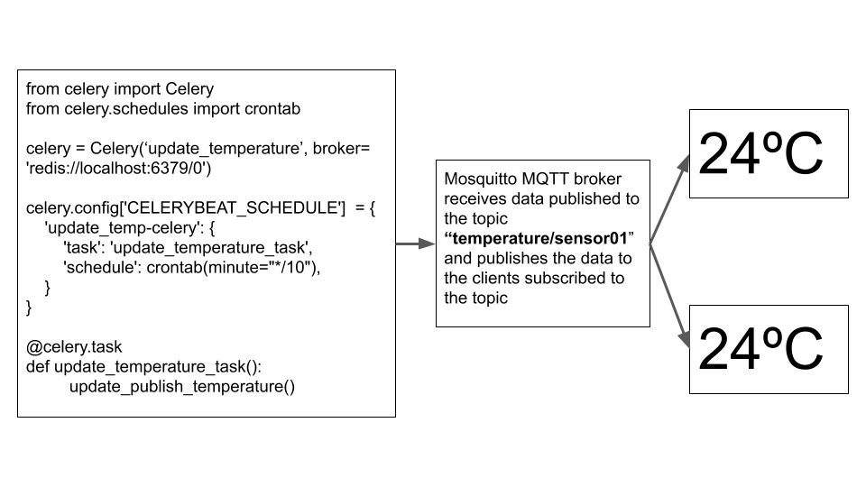

# Web app to control the AC over the internet.
This project is a web app to control an AC (Air Conditioner) in my room. Raspberry pi is used to host the web app and control the AC using an IR blaster.
Thw web app is built using a Flask framework and MQTT protocol is used to publish data to multiple users. Celery is used to scedule tasks and run asynchronous tasks.

## Features of the web app

* View current temperature of the room
* View temperature history of the room.
* Automatically acquire temperature data from the temperature sensor after every 10 mins.
* Control the AC by switching it ON/OFF, controlling the air temperature and fan speed.
* Sleep mode


## Code overview of the app
Following is an overview of the code and libraries used for various features of the app. Please refer the repository for complete code.

### Controlling the AC

When a button on the web app interface is pressed, (for eg. OFF) a HTTP POST request with the current state is sent to the Flask app. The app processes the data, sends the required IR signal to the AC and publishes the changed state to the MQTT broker for the topic "remote/update". The MQTT broker publishes data to all the clients subscribed to the topic "remote/update". There fore all the clients using the web app will have the updated current state.


### Periodically publishing sensor data to multiple devices
Temperature data acquired from DHT22 sensor is published over MQTT   to the topic “temperature/sensor01” after every 10 mins to all the clients subscribed to this topic. The periodic publishing of the data is done using the Celery Beat Scheduler.



### The Sleep Mode
The web app can shutdown the AC automatically at a particular time in the future. When the client sends a request to the app to shut the AC off at a particular time the app executes an asynchronous celery task which calculates the time difference in seconds between the time the sleep mode is set and the time you want the AC to turn off. The code execution will be delayed using the time.sleep() method after which the IR signal to turn off the AC is sent.


## Hardware requirements

* Raspberry Pi connected to the internet.
* DHT22/11 temeprature and humidity sensor.
* [IR blaster circuit](https://cdn.instructables.com/F1I/Y78D/JE94HH0B/F1IY78DJE94HH0B.LARGE.jpg) 

## Decoding IR (Infra Red) codes

The IR codes to control the AC are decoded using the [LIRC](http://www.lirc.org/). Refer this [blog](http://alexba.in/blog/2013/01/06/setting-up-lirc-on-the-raspberrypi/) to decode a the IR signal for a particular remote and setup the Raspberry PI for IR signal transmission through the IR blaster circuit.

The decoded IR codes are stored in a file called lirc. Following are the sample codes:-

```
 # contributed by : Chaitanya M
 #
 # brand:                       LG
 # model no. of remote control: 6711A20109B
 # devices being controlled by this remote:AIR CONDITIONER
begin remote
  name  LG
  bits           28
  flags CONST_LENGTH
  eps            30
  aeps          100

  header       8400  4200
  one           651  1515
  zero          651   459
  ptrail        651
  gap          103993
      begin codes
        AC16_LOW_TURNON		0x8800101
        AC16_MED_TURNON		0x8800123
        AC16_HI_TURNON		0x8800145      
      end codes
end remote
```
The IR signals can be sent using python as follows:-
```python
import os
os.system("irsend SEND_ONCE LG AC16_LOW_TURNON")
```
## Running the app

The web app can be started on the Raspberry Pi using the following steps:
1. [Install and configure Mosquitto Broker for websockets](https://gist.github.com/smoofit/dafa493aec8d41ea057370dbfde3f3fc)
2. Install and run redis message broker.
3. Execute the following command in linux CLI to start celery worker:
   ```
   $ celery -A main.celery worker --loglevel=INFO
   ```
4. Execute the following command in linux CLI to start celery beat scheduler:
   ```
   $ celery -A main.celery beat --loglevel=INFO
   ```
5. Execute the following command in linux CLI to start flask app:
   ```
   $ python main.py
   ```
6. Enter the IP adrress of the Raspberry pi with port number 8080 in the browser of the device connected to the same network to which the Raspberry pi is connected. Eg "192.169.1.101:8080"


